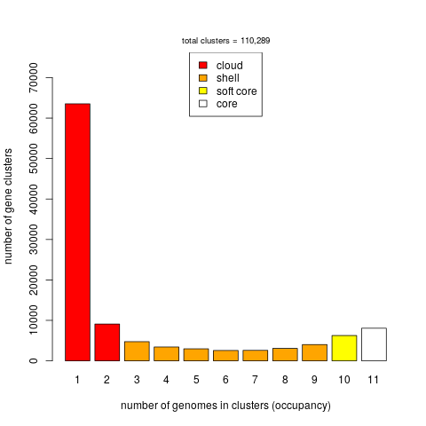

# Pan-gene analysis of clades in Ensembl Plant

This script interrogates Ensembl Plants through [REST endpoints](https://rest.ensembl.org) and the FTP site to carry out a clade-specific pan-gene set analysis. Instead of BLAST-based results, orthologies and paralogies are computed with the [Ensembl Compara](https://plants.ensembl.org/info/genome/compara/index.html) pipelines. This script is derived from scripts at the repository [Ensembl/plant_tools](https://github.com/Ensembl/plant_tools/tree/master/phylogenomics)

## Dependencies

The script requires the following non-core Perl modules:
* [HTTP::Tiny](https://metacpan.org/release/HTTP-Tiny)
* [JSON](https://metacpan.org/release/JSON)
* [DBI](https://metacpan.org/pod/DBI)
* [DBD::mysql](https://metacpan.org/pod/DBD::mysql)

which can be installed with: 
```
# install cpanminus installer, check more options at https://metacpan.org/pod/App::cpanminus
sudo cpan -i App::cpanminus  

# actually install modules
sudo apt-get install -y mysql-client libmysqlclient-dev
cpanm JSON JSON::XS HTTP::Tiny DBI DBD::mysql
```

In addition, the script imports module [PlantCompUtils.pm](./PlantCompUtils.pm), 
which is included here.

### ens_pangene_analysis.pl

```
usage: ens_pangene_analysis.pl [options]

-c NCBI Taxonomy clade of interest         (required, example: -c Brassicaceae or -c 3700)
-f output folder                           (required, example: -f myfolder)
-r reference species_name to name clusters (required, example: -r arabidopsis_thaliana)
-l list supported species_names            (optional, example: -l)
-o outgroup species_name                   (optional, example: -o brachypodium_distachyon)
-i ignore species_name(s)                  (optional, example: -i selaginella_moellendorffii -i ...)
-L allow low-confidence orthologues        (optional, by default these are skipped)
-S skip singletons                         (optional, by default unclustered sequences are taken)
-v verbose                                 (optional, example: -v

The following options are only available for some clades:

-G min Gene Order Conservation [0:100]  (optional, example: -G 75)
   see modules/Bio/EnsEMBL/Compara/PipeConfig/EBI/Plants/ProteinTrees_conf.pm
   at https://github.com/Ensembl/ensembl-compara

-W min Whole Genome Align score [0:100] (optional, example: -W 75)
   see ensembl-compara/scripts/pipeline/compara_plants.xml
   at https://github.com/Ensembl/ensembl-compara
```
Read about GOC and WGA at https://www.ensembl.org/info/genome/compara/Ortholog_qc_manual.html


The output folders contain pan-gene clusters, pangenome matrices in several formats and also a matrix of Percent Conserved Sequences (POCP), computed for the fraction of clusters shared by pairs of taxa being compared:
```
perl ens_pangene_analysis.pl -c Oryza -f Oryza -r oryza_sativa > Oryza.log
perl ens_pangene_analysis.pl -c Oryza -f Oryza -r oryza_sativa -S > Oryza.nosingletons.log
```

Those files can be used to produce pan-gene plots:

```
perl plot_pancore_matrix.pl -f core_both -i core_gene.tab

perl plot_pancore_matrix.pl -f pan -i pan_gene.tab
perl plot_pancore_matrix.pl -f pan -i pan_gene_nosingles.tab

perl plot_matrix_heatmap.sh -i POCP.matrix.tab -k "Percent Conserved Sequences (POCP)"

perl parse_pangenome_matrix.pl -m pangenome_matrix.tab -s

# matrix contains 110289 clusters and 11 taxa

# cloud size: 72627 list: pangenome_matrix__cloud_list.txt
# shell size: 23361 list: pangenome_matrix__shell_list.txt
# soft core size: 14301 list: pangenome_matrix__softcore_list.txt
# core size: 8052 (included in soft core) list: pangenome_matrix__core_list.txt
...
```


*Fig. 1. Core-gene plot of 11 Oryza species, generated with plot_pancore_matrix.pl*

All sequences | No singletons
:-------------------------:|:-------------------------:
 | 

*Fig. 2. Pan-gene plot of 11 Oryza species, generated with plot_pancore_matrix.pl. 
Left) all sequences; right) after excluding unclustered sequences (singletons).*



*Fig. 3. Occupancy of pan-gene clusters of 11 Oryza species, generated with parse_pangenome_matrix.pl*


*Fig. 4. Percent conserved sequence matrix of 11 Oryza species, generated with plot_matrix_heatmap.sh*

